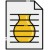

# Hey there, I'm Vignesh Rajagopal 👋

I'm a Product Design Engineer and Robotics Engineer passionate about creating innovative solutions that blend aesthetics and functionality. Welcome to my GitHub repository!

## 🔧 Technologies & Tools

- CAD: SolidWorks, Autodesk Fusion 360
- Programming: Python, C++
- Robotics: ROS (Robot Operating System)
- 3D Printing & Rapid Prototyping
   
- Programming:   
- CAD:   

## 📫 Get in Touch

- LinkedIn: ([https://www.linkedin.com/in/yourlinkedin](https://www.linkedin.com/in/vignesh-r-v-050720012r-d/))

- Email: vickyrv570@gmail.com

## 🚀 Let's Collaborate!

I'm always open to exciting collaborations and new opportunities. Feel free to reach out if you're interested in working together or have any questions about my projects.

